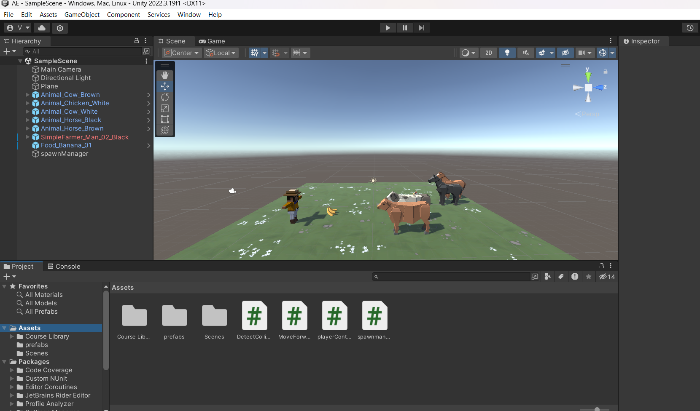

# Ex4.2-Animal-Feeding-Phase-2
## Aim:
To develop a animal feeding game-Phase-2 using unity.

## Algorithm:
## Step 1: 

In the Hierarchy, create an Empty object called “SpawnManager”

## Step 2: 

Create a new script called “SpawnManager”, drag the script and attach it to the Spawn Manager in the hierarchy , and open it

## Step 3: 

Declare new public GameObject[ ] animalPrefabs;

## Step 4: 

In the inspector assign the size as 3 , for each element drag the animals from prefabs folder into the array

## Step 5: 

Double-click on one of the animal prefabs, then Add Component > Box Collider

## Step 6: 

Check the “Is Trigger” checkbox

## Step 7: 

Add a RigidBody component to the (banana)projectile and uncheck “use gravity”.

## Step 8: 

Create a new DetectCollisions.cs script, then drag the scripts and add it to each animal prefab and banana, then open it and check it.

## Step 9: 

For all the animal prefabs and food in th inspector (below the layer ) drop down the override option and choose apply all.

## Program:

Developed by: Vinush.cv

Reg no: 212222230176

## Spawm Manager:
```c#
using System.Collections;
using System.Collections.Generic;
using UnityEngine;

public class spawnmanager : MonoBehaviour
{
    // Start is called before the first frame update
    public GameObject[] animalPrefabs;
    public float spawnRangeX = 10;
    private float spawnPosZ = 10;
    private float startDelay = 2;
    private float spawnInterval = 1.5f;
    void Start()
    {
        InvokeRepeating("SpawnRandomAnimal",startDelay,spawnInterval);
    }

    // Update is called once per frame
    void Update()
    {
     if(Input.GetKeyDown(KeyCode.S))
        {
            SpawnRandomAnimal();
        }
    }
    void SpawnRandomAnimal()
    {
        int animalIndex = Random.Range(0, animalPrefabs.Length);
        Vector3 spawnPos = new Vector3(Random.Range(-spawnRangeX, spawnRangeX), 0, spawnPosZ);
        Instantiate(animalPrefabs[animalIndex], spawnPos, animalPrefabs[animalIndex].transform.rotation);
    }
}
```

## Detectcollider:
```c#
using System.Collections;
using System.Collections.Generic;
using UnityEngine;

public class DetectCollision : MonoBehaviour
{
    // Start is called before the first frame update
    void Start()
    {
        
    }

    // Update is called once per frame
    void Update()
    {
        
    }
    private void OnTriggerEnter(Collider other)
    {
        Destroy(gameObject);
        Destroy(other.gameObject);
    }
}
```
## Output:



## Result:

Animal feeding game-Phase-2 using unity is developed successfully.


